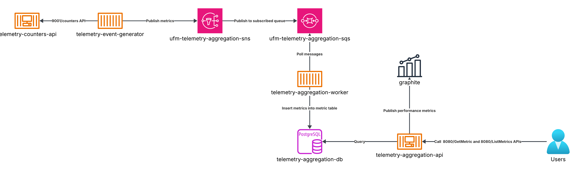

# UFM Telemetry Aggregation Service

A FastAPI-based service for aggregating and managing UFM (Unified Fabric Manager) telemetry data.

## Quick Start

### Prerequisites

- Docker
- Docker Compose

### Clone the Repository

```bash
git clone <repository-url>
cd ufm-telemetry-aggregation-service
```

### Local Development Setup

1. **Start the services:**
   ```bash
   cd local
   docker-compose up -d
   ```

2. **Check service status:**
   ```bash
   docker-compose ps
   ```

3. **View logs:**
   ```bash
   docker-compose logs -f api
   ```

4. **Stop the services:**
   ```bash
   docker-compose down
   ```

## API Examples

The service runs on `http://localhost:8080` and provides the following endpoints:

### Health Check

Check if the service is running and healthy:

```bash
curl -X GET "http://localhost:8080/telemetry/health"
```

**Response:**
```json
{
  "service": "ufm-telemetry-aggregation-service",
  "status": "OK",
  "version": "1.0.0"
}
```

### Get Metric

Retrieve a specific metric for a switch:

```bash
curl -X GET "http://localhost:8080/telemetry/GetMetric/{metric_name}/{switch_id}"
```

**Example:**
```bash
curl -X GET "http://localhost:8080/telemetry/GetMetric/cpu_utilization/switch_001"
```

**Response:**
```json
{
  "switch_id": "switch_001",
  "metric_name": "cpu_utilization",
  "value": 75.5,
  "timestamp": "2024-01-01T12:00:00Z"
}
```

### List Metrics

Retrieve multiple metrics with pagination:

```bash
curl -X GET "http://localhost:8080/telemetry/ListMetrics/{metric_name}?limit=10&offset=0"
```

**Example:**
```bash
curl -X GET "http://localhost:8080/telemetry/ListMetrics/cpu_utilization?limit=5&offset=0"
```

**Response:**
```json
{
  "metrics": [
    {
      "switch_id": "switch_001",
      "metric_name": "cpu_utilization",
      "value": 75.5,
      "timestamp": "2024-01-01T12:00:00Z"
    }
  ],
  "total": 100,
  "limit": 5,
  "offset": 0
}
```

### Interactive API Documentation

Once the service is running, you can access the interactive API documentation:

- **Swagger UI:** http://localhost:8080/docs
- **ReDoc:** http://localhost:8080/redoc

## System Architecture



## System Overview

The UFM Telemetry Aggregation Service is designed as a robust, scalable, and highly available system for collecting, processing, and serving network switch telemetry data. The architecture follows modern microservices principles with clear separation of concerns across three main operational layers.

### 1. Telemetry Generation

**Source & Collection:**
Telemetry data originates from a dedicated REST API service running in the `telemetry-counters-api` container. This API exposes real-time switch metrics through a `/counters` endpoint at `http://localhost:9001/counters`, delivering the data in CSV format.

**Event Generation:**
The `telemetry-event-generator` container operates as a periodicic client, fetching fresh metrics from the `/counters` endpoint. This component transforms raw CSV data into structured telemetry objects and publishing the metrics in  batches of 10 messages every 10 seconds to an AWS SNS topic (emulated via LocalStack).

### 2. Data Handling

**Decoupled Message Architecture:**
The system implements a message-driven architecture that completely decouples metric ingestion from storage operations. SNS topics connect to SQS queues, creating a durable, fault-tolerant buffer that can handle traffic spikes and temporary service outages.

**Processing Pipeline:**
The `telemetry-aggregation-worker` container serves as the system's data processing engine, continuously consuming messages from the SQS queue. Each worker processes metric batches, performs data validation and transformation, then persists structured data to the PostgreSQL metrics table.

**Optimized Database Schema:**
The PostgreSQL metrics table is designed for high-performance queries and comprehensive monitoring capabilities. The schema includes an index on the `switch_id` column, enabling fast retrieval of metrics for specific switches ids by the `/GetMetric` endpoint.

The table employs a dual-timestamp approach:
- **Collection Time:** Records when the metric was originally calculated by the counters API
- **Insertion Timestamp:** Captures when the metric was persisted to the database

This design enables system health monitoring. The difference between collection time and insertion timestamp serves as a real-time indicator of processing latency. Large gaps can signal bottlenecks in the ingestion pipeline, network issues, or resource constraints. This latency differential can be leveraged to:
- Create automated alerts for processing delays
- Generate system health metrics and dashboards  
- Trigger auto-scaling events when latency thresholds are exceeded
- Provide operational insights for capacity planning

**Key Advantages:**
- **Fault Tolerance:** SQS message persistence ensures zero data loss during system maintenance or failures
- **Elastic Scalability:** Worker containers can be horizontally scaled based on queue depth, automatically adapting to load
- **Performance Optimization:** Batch processing minimizes database connections and transaction overhead
- **Operational Resilience:** Message replay capability enables recovery from processing errors
- **Load Distribution:** Multiple workers can process messages concurrently for maximum throughput

### 3. REST Server Integration

**API Layer:**
The `telemetry-aggregation-api` container provides a RESTful interface for accessing processed telemetry data. This FastAPI-based service executes queries directly against the PostgreSQL database and delivering real-time
insights.

**Enterprise-Ready Features:**
- **Real-Time Access:** Direct database queries ensure immediate access to the latest processed metrics
- **Comprehensive API:** Full CRUD operations with advanced filtering, pagination, and search capabilities  
- **Interactive Documentation:** Built-in Swagger UI and ReDoc for seamless API exploration and testing
- **Type Safety:** Pydantic models ensure data consistency and automatic API documentation

**Key Advantages:**
- **Low Latency:** Direct database access minimizes response times for analytical queries
- **Developer Experience:** OpenAPI specification enables automatic client generation and testing
- **Monitoring Ready:** Built-in health checks and metrics endpoints support operational monitoring
- **Scalable Architecture:** Stateless design allows horizontal scaling of API instances

**Container-Native Design:**
All system components are orchestrated using Docker Compose.

## Limitations and improvement suggestions
1. **Single Worker Instance Bottleneck**
   
   **Limitation:**
   Currently, the system is configured to run only a single instance of the telemetry-aggregation-worker. In scenarios where a high volume of telemetry messages accumulate in the     SQS queue, this single worker may become a processing bottleneck. As a result, there can be increased latency in persisting metrics to the database, potentially impacting the      timeliness of analytics and monitoring.

   **Improvement Suggestion:**
   Implement horizontal scaling for the worker service by enabling autoscaling based on the number of messages in the SQS queue. This would allow the system to automatically          launch additional worker instances under high load, ensuring timely processing and ingestion of telemetry data.


2. **No Dead Letter Queue (DLQ) for Failed Messages**
   
   **Limitation:**
   Currently, messages that repeatedly fail to be processed by the worker are retried indefinitely in the main SQS queue. This can lead to message processing loops and possible       backlog growth if certain messages are "poison" (malformed or unprocessable).

   **Improvement Suggestion:**
   Configure an SQS Dead Letter Queue (DLQ) to catch messages that fail processing after a set number of retries. This allows for easier investigation and handling of problematic     data, and prevents them from blocking the processing of valid messages.


3. **Database Connection Limits**
   
   **Limitation:**
   Both the worker and API services establish direct connections to the PostgreSQL database. In scenarios with high concurrency—such as when scaling out multiple worker instances     or serving many API requests in parallel—this can quickly exhaust the maximum number of allowed database connections. Exceeding this limit may lead to failed connections,          increased latency, or even downtime for parts of the system.

   **Improvement Suggestion:**
   Introduce a database connection pool to efficiently manage and reuse database connections across both the worker and API services. Tools like SQLAlchemy’s built-in connection      pooling or external poolers such as PgBouncer can help limit the total number of open connections, reduce overhead, and improve overall database performance and stability.         Additionally, review and tune the database’s max connections setting to align with expected peak loads and resource constraints.


4. **API Rate Limiting Constraints**

   **Limitation:**
   The REST API does not currently enforce any rate limiting on incoming requests. In high-traffic scenarios, this can allow a large number of simultaneous or rapid requests,         potentially overwhelming the API service and the underlying database. Such an overload can degrade system performance, increase response times, and in extreme cases, lead to       service outages for all users.

   **Improvement Suggestion:**
   Implement API rate limiting to control the number of requests each client or IP address can make within a given time window. Rate limiting can be enforced at the application       level (using middleware, such as SlowAPI for FastAPI) or at the network/proxy level (using tools like NGINX, Traefik, or AWS API Gateway). This will help protect system            resources, ensure fair usage among clients, and improve overall reliability and quality of service.


5. **Impact of Growing Metric Table on Performance**

   **Limitation:**
   As the volume of telemetry data grows, the number of rows in the `metric` table will continuously increase. This growth can lead to slower API response times and degraded            database performance, especially for read-heavy queries, analytical workloads, and insert operations. Maintaining indexes on large tables can also increase insertion time, as      each new row requires updates to the index structures. Over time, this can result in higher latency and reduced throughput for both data ingestion and data retrieval.

   **Improvement Suggestion:**
   1. Table Partitioning: Partition the table by time (e.g., daily, monthly) or switch ID to improve query and write performance and make data management tasks (archiving, deletion)     more efficient.
   2. Archiving and Retention Policies: Regularly archive or delete old telemetry data that is no longer needed for real-time queries or compliance, reducing the working set size.


6. **Database Lock Contention**
   
   **Limitation:**
   When multiple worker or API instances perform concurrent write or update operations on the metric table, PostgreSQL may need to acquire locks to maintain data consistency. As      the system scales or if long-running transactions occur, this can lead to lock contention—where operations must wait for locks to be released—resulting in increased query          latency, slower insertions, and in some cases, transaction deadlocks or timeouts.

   **Improvement Suggestion:**
   1. Partitioning: Partitioning large tables can help by reducing lock scope to partitions rather than the entire table.
   2. Optimize Transaction Scope: Keep transactions as short as possible and avoid holding locks longer than necessary. Always commit or rollback promptly.
   3. Batch Inserts: Where possible, insert multiple records in a single transaction to reduce the number of lock acquisitions.


7. **Use of HTTP Instead of HTTPS (Security Concern)**

   **Limitation:**
   Currently, the system’s REST APIs and internal service communications use plain HTTP rather than HTTPS. This means that data—including sensitive telemetry, credentials, and        user queries—is transmitted in unencrypted form over the network. This exposes the system to security risks such as eavesdropping, man-in-the-middle attacks, and data              tampering, especially in production environments or when running outside of trusted internal networks.

   **Improvement Suggestion:**
   Enable HTTPS for all REST endpoints and internal service communication, for example by configuring each service to use TLS certificates, ensuring encrypted data in transit.


8. **Lack of Support for Important (High-Priority) Customers**

   **Limitation:**
   The current system processes all telemetry data uniformly, without distinguishing between standard and high-priority (important) customers. This means that critical data from      key customers may experience delays or become backlogged behind less critical traffic during high-load periods. There is no mechanism to prioritize, isolate, or guarantee          faster handling of telemetry for important customers.

   **Improvement Suggestion:**
   1. Creating Dedicated Queues: Route high-priority customer telemetry to separate SQS queues and/or SNS topics, allowing for isolated and prioritized processing pipelines.
   2. Dedicated Database Resources: Optionally, store high-priority customer data in a dedicated database or schema to ensure availability, faster queries, and simplified data           governance for these customers.
   3. Priority-Aware Workers: Implement separate or prioritized worker pools for high-priority queues, ensuring their data is processed with minimal delay.

  
9.  **Lack of Caching Mechanism**

    **Limitation:**
    The current system processes every API request by querying the PostgreSQL database in real-time, even for frequently requested or computationally expensive data. This approach     can lead to increased database load, higher response times, and reduced scalability—particularly under heavy or repetitive access patterns.

    **Improvement Suggestion:**
    1. In-Memory Caching: Use an in-memory cache such as Redis or Memcached to store recently or frequently accessed metrics.
    2. API-Level Caching: Cache popular API responses at the application or gateway/proxy level.
    3. Cache Invalidation: Establish strategies for cache invalidation or expiration to ensure data freshness and consistency.
    4. Selective Caching: Apply caching selectively to endpoints that benefit most, such as those serving aggregate metrics or read-heavy queries.


10.  **Lack of Multi-Region Support**

   **Limitation:**
   The current system is deployed in a single region or data center. As a result, users and systems located far from the deployment region may experience increased latency when       sending telemetry data or querying the REST API. This can negatively impact user experience, real-time monitoring, and the timeliness of telemetry processing, especially for       globally distributed customers or edge devices.

   **Improvement Suggestion:**
   Deploying System Components in Multiple Regions: Run instances of the API, worker, and supporting infrastructure (queues, databases) in geographically distributed regions to       serve local traffic with lower latency.


11. **Lack of Load Balancing for the API**

    **Limitation:**
    Currently, the REST API is exposed as a single instance without any load balancing mechanism. As a result, all incoming client requests are directed to a single API container.     This setup limits the system’s ability to handle high traffic volumes, leads to uneven resource utilization, and may create a single point of failure. If the API instance          becomes overloaded or unavailable, users may experience degraded performance or complete service outages.

    **Improvement Suggestion:**
    1. Deploying Multiple API Containers: Run several instances of the API service in parallel.
    2. Using a Load Balancer: Place a load balancer (such as NGINX, HAProxy, Traefik, or a cloud-native solution like AWS Elastic Load Balancer) in front of the API containers to         automatically route and balance requests.
    3. Health Checks and Auto-Scaling: Integrate health checks to ensure only healthy instances receive traffic, and enable auto-scaling to add or remove API instances based on           demand.

